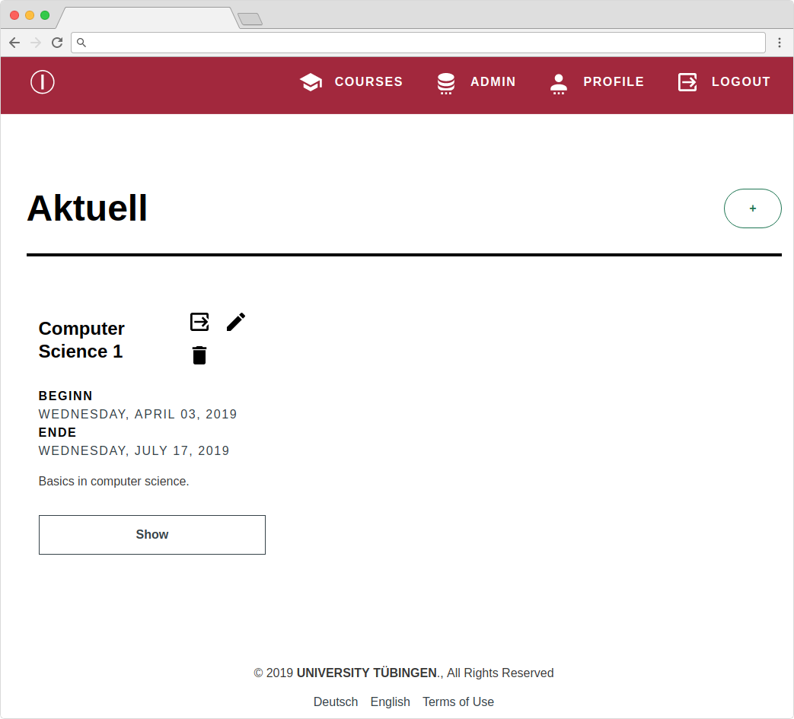

# InfoMark

|Frontend|Backend|
|----|----|
|||
| [git+source](https://github.com/cgtuebingen/infomark-ui), [download](https://github.com/cgtuebingen/infomark-ui/releases/latest) | [git+source](https://github.com/cgtuebingen/infomark-backend), [download](https://github.com/cgtuebingen/infomark-ui/releases/latest)|

InfoMark is an is a scalable, modern and open-source [rewrite of our](https://github.com/cgtuebingen/InfoMark-deprecated) online course management system with auto testing of students submissions [(video)](https://www.youtube.com/watch?v=ifyUssK6PJ4) using unit tests to ease the task of TAs.

See [https://infomark.org](https://infomark.org) for more details.

Features:
- flexible client/server implementation featuring unit-tests
- distribute exercise sheets with due-dates, and course slides/material with publish-dates
- students can upload their solutions
- assignments of students to exercise groups according to their bids is optimized via MILP solver
- automatic asynchronous testing of students homework solutions by scalable background workers using docker as a sandbox and providing feedback for students
- easy to install using docker-compose for dependencies and single binary for the server
- CLI for administrative work without touching the database

The [InfoMark-frontend](https://github.com/cgtuebingen/infomark-ui) is Single-Page-Applications written in [Elm]((https://elm-lang.org/)) based on REST-backend server [InfoMark-backend](https://github.com/cgtuebingen/infomark-backend) written in [Go](https://golang.org/). Communication to internal background workers uses [RabbitMQ](https://www.rabbitmq.com/) and data is stored in a [PostgreSQL](https://www.postgresql.org/) database. The [Swagger](https://swagger.io/) definitions for the REST endpoints can be automatically generated from the REST server. It is possible to export/import the [Symphony](https://projects.coin-or.org/SYMPHONY) problem/solution format.

This gives all the advantages:
- Cross-platform: backend runs on OSX, Linux and Windows
- Easy to Install: a single binary contains the entire backend
- Minimal Dependencies: just RabbitMQ, Redis and PostgreSQL are required
- Highly-Scalable: background workers can be deployed on different machines and the unit-test workload will be distributed amongst them